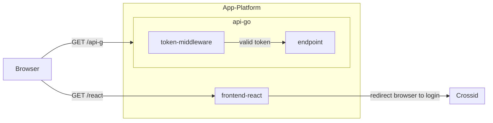
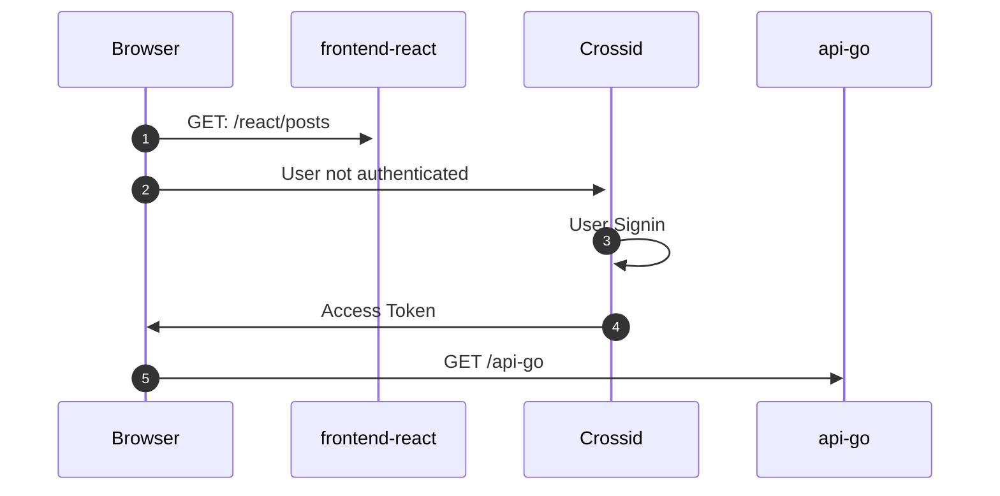

import AddSpaApp from "../src/components/\_AddSpaApp.mdx";
import AppUserAssignment from "../src/components/AssignUserToApp.mdx";

With DigitalOcean app platform, it is possible to deploy multiple components (such as _frontend_ and _backend_) from a single code repository.

A _monorepo_ makes it easier to maintain sets of related components that work together. It typically has a single build pipeline, code standardization can be enforced on all components together and it greatly improves collaboration by code sharing as team scales.

This blog explains how to deploy a monorepo with identity-awareness on DigitalOcean app platform.

Freeing you from implementing authentication yourself, so you can focus on things that make you unique.

Final source code available here: https://github.com/crossid/sample-monorepo

## Prerequisites

To deploy yourself, you need to have:

1. DigitalOcean account, or [signup](https://cloud.digitalocean.com/registrations/new).
1. Crossid tenant, or [signup](https://www.crossid.io/signup) for free.

## Components

The sample repo introduces two components:

1. _api-go_ - Protected micro service HTTP endpoint, written in Golang.
1. _frontend-react_ - SPA that performs performs authentication and consumes the `/api-go` endpoint, written in React.js.

_components diagram_



### api-go - an HTTP micro service.

The component [/api-go](https://github.com/crossid/sample-monorepo/tree/main/api-go) demonstrates how to expose a protected HTTP endpoint, in Golang.

It response some data only if the request was sent with a valid access token.

:::note
Micro services should be kept simple and not handle any user authentication. it's up to a frontend (see below) to authenticate visitors and pass a valid access-token to the service.
:::

1. Client sends a request, providing a valid access token.
1. The _token middleware_ verifies token validity or denies the request.
1. If token is valid, the endpoint is invoked, returning some data.

### frontend-react - SPA frontend

The component [/frontend-react](https://github.com/crossid/sample-monorepo/tree/main/frontend-react) demonstrates how to build a static SPA app, written in React.js.

The _frontend-react_ component let user:

- Let visitors see the home page, anonymously.
- A protected route (_/posts_) that can only be seen by authenticated users. this route also consumes our _api-go_ service.
- Sign users in via Crossid.
- Sign users out via Crossid.

_interaction diagram_



1. An anonymous visitor tries to access `/react/posts`, a protected react route.
1. Browser is redirected to Crossid for login.
1. User logs in using its credentials (OTP, TOTP, Fingerprint, etc...)
1. Browser is redirected back to `/react/posts` route with a valid access-token.
1. The react app consumes the `/api-go` services by providing a valid access-token.

## Let crossid know about React

Before deployment, we need to [let Crossid know about your React app](/docs/guides/howto/add-spa-app).

:::note
Our application URL will only be known after deployment, put _https://localhost_ as a placeholder, we'll replace them later.
:::

<AddSpaApp/>

Then grant your identity access to the _react_ app:

<AppUserAssignment/>

Save the _Client ID_ to the next deployment steps.

## Deploy on DigitalOcean

We have two components to deploy:

- `/api-go` as a [service](https://docs.digitalocean.com/products/app-platform/concepts/service/), exposed under `/api-go`.
- `/frontend-react` as [static site](https://docs.digitalocean.com/products/app-platform/concepts/static-site) , exposed under `/react`.

### doctl

`doctl` allows you to interact with the DigitalOcean API via CLI. for the purpose of this blog, we use it to deploy our components in app platform.

The app platform requires a single [app.yaml](https://github.com/crossid/sample-monorepo/blob/main/.do/app.yaml) file that defines the components to be deployed in app platform.

1. Fork [crossid/sample-monorepo](https://github.com/crossid/sample-monorepo) so you can modify it.
1. Edit `.do/app.yaml` **envs** and commit it afterwards.

| env var                 | note                         | example                        |
| ----------------------- | ---------------------------- | ------------------------------ |
| REACT_APP_CID_TENANT_ID | your crossid tenant id       | acme                           |
| REACT_APP_CID_CLIENT_ID | client_id from previous step | X2QnH2u4x5b2nMHnzqqeN...       |
| ISSUER_BASE_URL         | oauth2 auth server base url  | https://acme.crossid.io/oauth2 |

Deploy by:

`doctl apps create --spec .do/app.yaml`

To track the deployment progress:
`doctl a lsd $(doctl a list --format ID --no-header)`

Once app is deployed, get its external URL by:

```bash
doctl apps list --format DefaultIngress --no-header
# output example
# https://sample-monorepo-l38pj.ondigitalocean.app
```

## Update Crossid app

Lets update our app in crossid with the URL assigned to our app:

1. In admin, go to **Applications** -> **Applications** and select our **React** application.
1. Update the fields as explained below:

| field                | example                                                 | note                                                           |
| -------------------- | ------------------------------------------------------- | -------------------------------------------------------------- |
| Login Redirect URIs  | https://sample-monorepo-l38pj.ondigitalocean.app/react/ | The whitelisted URI to redirect browser once login completes.  |
| Logout Redirect URIs | https://sample-monorepo-l38pj.ondigitalocean.app/react/ | The whitelisted URI to redirect browser once logout completes. |
| Allowed Cors Origins | https://sample-monorepo-l38pj.ondigitalocean.app*       | The whitelisted URI to allow CORS.                             |

Now hit https://sample-monorepo-l38pj.ondigitalocean.app/react and see it in action!

## Recap

DigitalOcean app platform is a PAAS that let you focus on code rather infra, Crossid is a SAAS IAM that frees you from handling identity, when combining those together, you focus on things that make you unique.


## References

- https://github.com/crossid/sample-monorepo
- https://github.com/digitalocean/sample-monorepo
- [App Platform Monorepos Youtube](https://www.youtube.com/watch?v=PmFtK01G_A8)
